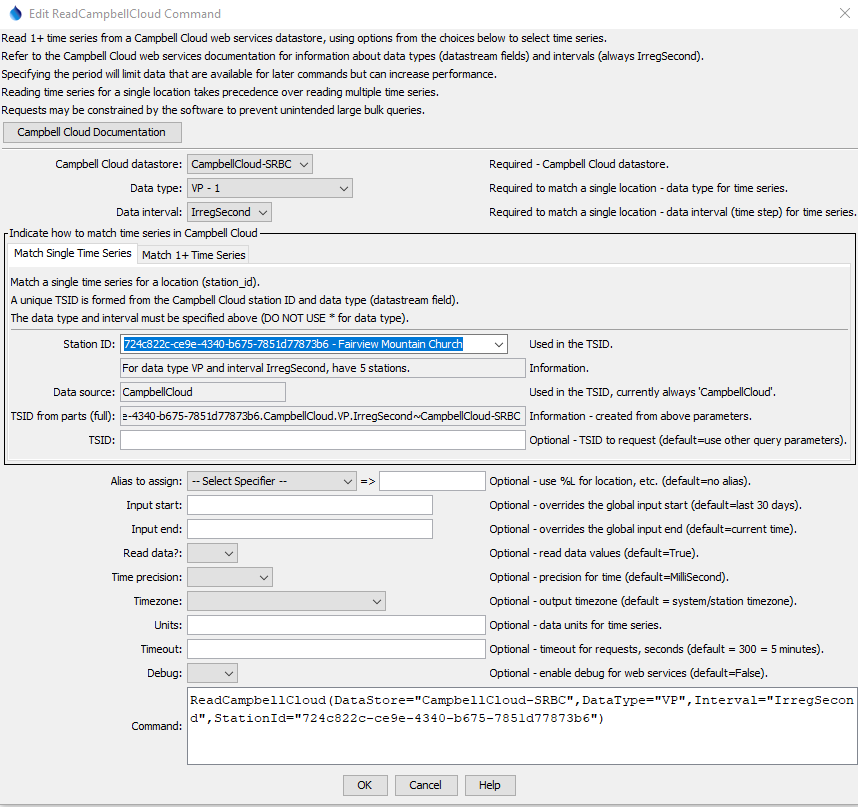
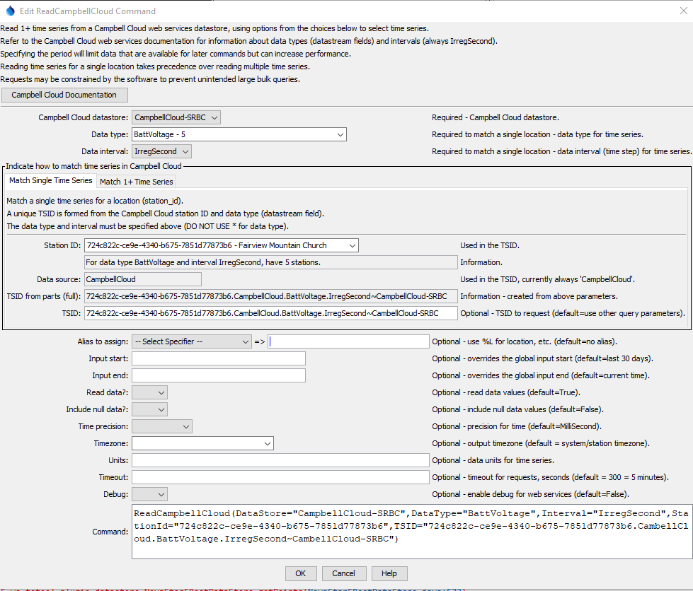
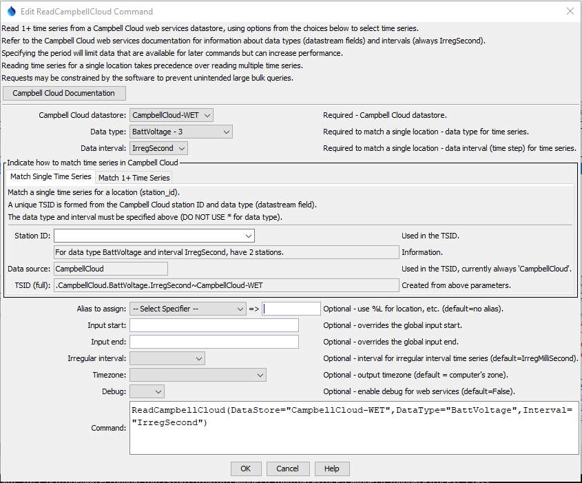

# TSTool / Command / ReadCampbellCloud #

*   [Overview](#overview)
*   [Command Editor](#command-editor)
    +   [Match Single Time Series (using a station ID)](#match-single-time-series-using-a-station-id)
    +   [Match Single Time Series (using a TSID)](#match-single-time-series-using-a-tsid)
    +   [Match 1+ Time Series (Using a TSID)](#match-1-time-series)
*   [Command Syntax](#command-syntax)
*   [Examples](#examples)
*   [Troubleshooting](#troubleshooting)
*   [See Also](#see-also)

-------------------------

## Overview ##

The `ReadCampbellCloud` command reads one or more time series from Campbell Cloud web services:

*   Read a single time series by matching a TSTool time series identifier (TSID).
*   Read 1+ time series using filters similar to the main TSTool window.
    The list of time series is determined from the time series catalog and then each time series is read.

See the [Campbell Cloud Web Services Appendix](../../datastore-ref/CampbellCloud/CampbellCloud.md)
for more information about Campbell Cloud web service integration and limitations.
The command is designed to utilize web service query criteria to process large numbers of time series,
for example to produce real-time information products and perform historical data analysis and quality control.

See also the 
[TSID for Campbell Cloud](../TSID/TSID.md) time series identifier command,
which reads time series for a single time series.

The ***Data type***, ***Data interval***, and ***Where*** input fields
are similar to those in the main TSTool interface.
However, whereas the main TSTool interface first requires a query to find the
matching time series list and interactive select to copy specific time series identifiers into the ***Commands*** area,
the `ReadCampbellCloud` command automates reading the time series list and the corresponding data for the time series.

Because Campbell Cloud stores timestamped sensor data that typically have irregular times (not even seconds or minutes),
TSTool uses an interval of `IrregSecond` for all data,
with a default time precision of `MilliSecond` for the start and end, and data timestamps.
Additional functionality may be enabled in the future as Campbell Cloud data are used operationally. 

Using the `ReadCampbellCloud` command can greatly shorten command files and simplify command logic
when processing many time series.
However, because the command can process many time series and web services are impacted by network speed,
running the command can take a while to complete.
Checks are in place to constrain queries,
for example defaulting to 30 days if the period is not specified.

Data for the location and other time series metadata,
as shown in the main TSTool interface, are set as time series properties, using web service data values.
Right-click on a time series in the TSTool ***Results*** area and then use the
***Time Series Properties*** menu to view time series properties.
These properties can be transferred to a table with the
[`CopyTimeSeriesPropertiesToTable`](https://opencdss.state.co.us/tstool/latest/doc-user/command-ref/CopyTimeSeriesPropertiesToTable/CopyTimeSeriesPropertiesToTable/)
command and processed further with other table commands.
When matching multiple time series,
it is also possible to create a table of time series metadata rather than reading the time series
(see the `ReadTimeSeries=False` and `TimeSeriesCatalogTableID` command parameters).

## Command Editor ##

The following dialog is used to edit the command and illustrates the syntax for the command.
Two options are available for matching time series.

### Match Single Time Series (using a station ID) ###

The following example illustrates how to read a single time series by specifying the data type and interval (top)
and station identifier (***Match Single Time Series*** tab).
This approach is similar to using the general
[`ReadTimeSeries`](https://opencdss.state.co.us/tstool/latest/doc-user/command-ref/ReadTimeSeries/ReadTimeSeries/)
command but offers parameters specific to Campbell Cloud web services.

**<p style="text-align: center;">

</p>**

**<p style="text-align: center;">
`ReadCampbellCloud` Command Editor to Read a Single Time Series by Matching a Station ID (<a href="../ReadCampbellCloud-single.png">see full-size image</a>)
</p>**

### Match Single Time Series (using a TSID) ###

Alternatively, the `TSID` parameter can be specified to read a single time series.

**<p style="text-align: center;">

</p>**

**<p style="text-align: center;">
`ReadCampbellCloud` Command Editor to Read a Single Time Series by Matching a TSID (<a href="../ReadCampbellCloud-single-tsid.png">see full-size image</a>)
</p>**

### Match 1+ Time Series ###

The following figure illustrates how to query multiple time series.
For example, this can be used to process all time series of a data type in the system
or all time series for a location.

**<p style="text-align: center;">

</p>**

**<p style="text-align: center;">
`ReadCampbellCloud` Command Editor to Read Multiple Time Series (<a href="../ReadCampbellCloud-multiple.png">see full-size image</a>)
</p>**

## Command Syntax ##

The command syntax is as follows:

```text
ReadCampbellCloud(Parameter="Value",...)
```

**<p style="text-align: center;">
Command Parameters
</p>**

|**Tab**|**Parameter**&nbsp;&nbsp;&nbsp;&nbsp;&nbsp;&nbsp;&nbsp;&nbsp;&nbsp;&nbsp;&nbsp;&nbsp;&nbsp;&nbsp;&nbsp;&nbsp;&nbsp;&nbsp;|**Description**|**Default**&nbsp;&nbsp;&nbsp;&nbsp;&nbsp;&nbsp;&nbsp;&nbsp;&nbsp;&nbsp;&nbsp;&nbsp;&nbsp;&nbsp;&nbsp;&nbsp;&nbsp;&nbsp;&nbsp;&nbsp;&nbsp;&nbsp;&nbsp;&nbsp;&nbsp;&nbsp;&nbsp;|
|--------------|-----------------|-----------------|--|
|All|`DataStore`<br>**required**|The Campbell Cloud datastore name to use for the web services connection, as per datastore configuration files (see the [Campbell Cloud Web Services Datastore appendix](../../datastore-ref/CampbellCloud/CampbellCloud.md)). | None - must be specified. |
||`DataType`<br>**required**|The data type to be queried, corresponding to Campbell datastream `field`, can be specified using `${Property}`.. | `*` to read all the time series. |
||`Interval`<br>**required**|The data interval for the time series, currently always `IrregSecond`.  The interval is currently NOT used to filter time series. | `*` - to read all the time series. |
|***Match Single Time Series***|`StationId`|The station identifier, corresponding to Campbell Cloud `station_id`. | Specify if `TSID` is not specified to read a single time series. |
||`TSID`| The time series identifier for the time series to read. | Specify for a single time series if `StationId` is not specified. |
|***Match 1+ Time Series***|`WhereN`|When reading 1+ time series, the “where” clauses to be applied.  The filters match the values in the Where fields in the command editor dialog and the TSTool main interface.  The parameters should be named `Where1`, `Where2`, etc., with a gap resulting in the remaining items being ignored.  The format of each value is:<br>`Item;Operator;Value`<br>Where `Item` indicates a data field to be filtered on, `Operator` is the type of constraint, and `Value` is the value to be checked when querying.<br>**Additional functionality will be added in the future.**|If not specified, the query will not be limited and large numbers of time series may be queried.|
| | `ReadTimeSeries` | Indicate whether time series should be read: <ul><li>`False` - do not read time series (specify the `TimeSeriesCatalogTableID` parameter to output a time series metadata table).</li><li>`True` - read time series</li></ul> | `True` |
| | `TimeSeriesCatalogTableID` | Output table for time series metadata. | |
|All|`Alias`<br>|The alias to assign to the time series, as a literal string or using the special formatting characters listed by the command editor.  The alias is a short identifier used by other commands to locate time series for processing, as an alternative to the time series identifier (`TSID`).|None – alias not assigned.|
||`InputStart`|Start of the period to query, specified as a date/time with a precision of `MilliSecond` unless the `TimePrecision` parameter is specified.  If not specified, the time zone will default to the computer's time zone. |Read most recent 30 days of data.|
||`InputEnd`|End of the period to query, specified as a date/time with a precision `MilliSecond` unless the `TimePrecision` parameter is specified.  If not specified, the time zone will default to the computer's time zone. |Read most recent 30 days of data. |
|| `ReadData` | Indicate whether time series data should be read: <ul><li>`False` - only read time series metadata</li><li>`True` - read time series metadata and data</li></ul> | `True` |
|| `IncludeNullData` | Indicate whether to include null data values in output, which is useful for troubleshooting: <ul><li>`False` - do not include null values</li><li>`True` - include null values</li></ul> | `False` |
|| `TimePrecision` | Campbell Cloud measurements have report times with sub-second precision.  Other data management systems may not store data to the same time precision.  This parameter can be used to control the CampbellCloud time precision to ensure that the format is appropriate for data use.  Specify as:<ul><li>`NanoSecond`</li><li>`MicroSecond`</li><li>`MilliSecond`</li><li>`HSecond`</li><li>`Second`</li></ul>| `MilliSecond` |
|| `Units` | The data units to assign to the time series.  Campbell Cloud does not provide data units in the web services API so the units must be determined from sensor documentation. | No units are assigned. |
||`Timezone`| The time zone for output.  The Campbell Cloud UTC times will be converted to the requested time zone.  Specify the time zone using a name from the ["List of tz database time zones" on Wikipedia](https://en.wikipedia.org/wiki/List_of_tz_database_time_zones) (e.g., `America/Denver` or `US/Eastern`). See the [Campbell Cloud Datastore / Timezone Handling](../../datastore-ref/CampbellCloud/CampbellCloud.md#timezone-handling) documentation for more information. Can be specified using `${Property}` syntax.| `UTC`. |
||`Timeout` | The number of seconds allowed for web service requests before timing out. | 300 (5 minutes). |
||`Debug`| Used for troubleshooting:  `False` or `True`. | `False` |

## Examples ##

See the [automated tests](https://github.com/OpenWaterFoundation/owf-tstool-campbellcloud-plugin/tree/main/test/commands/ReadCampbellCloud/).

## Troubleshooting ##

Refer to the TSTool log file.  Use the
[`SetDebugLevel`](https://opencdss.state.co.us/tstool/latest/doc-user/command-ref/SetDebugLevel/SetDebugLevel/) command
to increase the amount of output for debugging.

## See Also ##

*   [`CopyTimeSeriesPropertiesToTable`](https://opencdss.state.co.us/tstool/latest/doc-user/command-ref/CopyTimeSeriesPropertiesToTable/CopyTimeSeriesPropertiesToTable/) command
*   [`ReadTimeSeries`](https://opencdss.state.co.us/tstool/latest/doc-user/command-ref/ReadTimeSeries/ReadTimeSeries/) command
*   [TSID for Campbell Cloud](../TSID/TSID.md) command
*   [`WebGet`](https://opencdss.state.co.us/tstool/latest/doc-user/command-ref/WebGet/WebGet/) command
