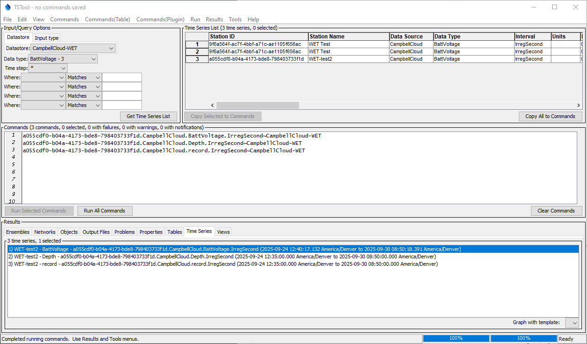
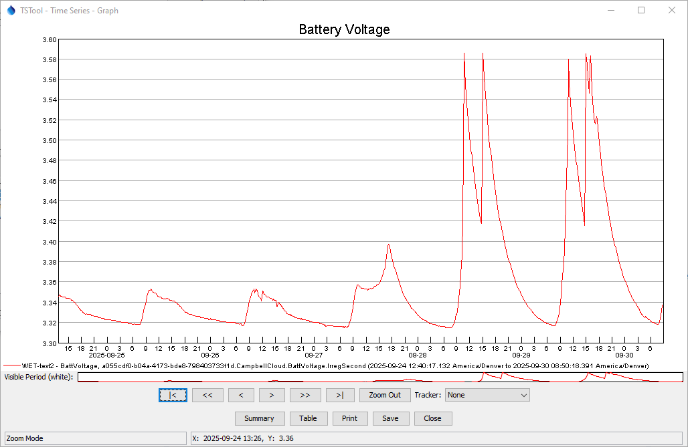
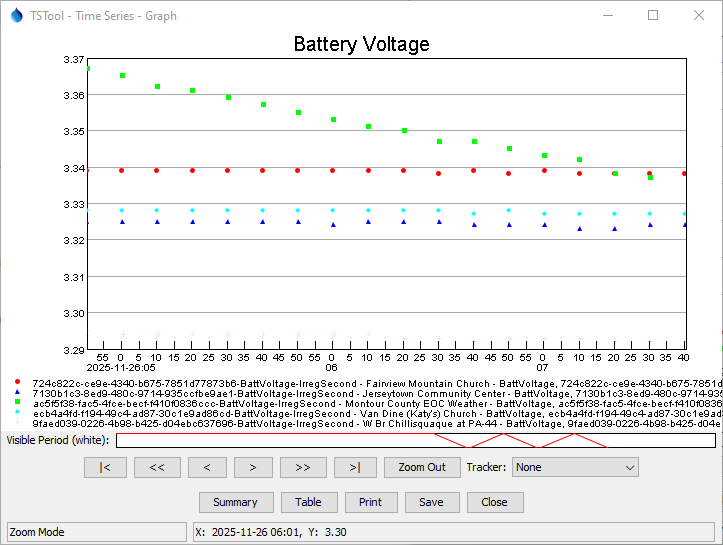
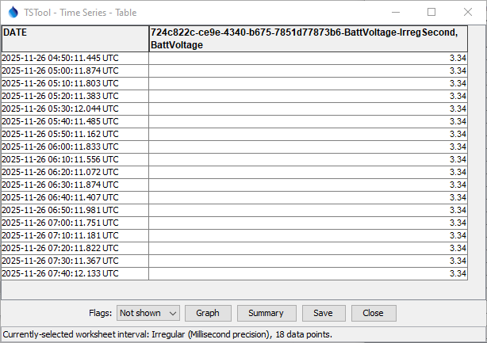
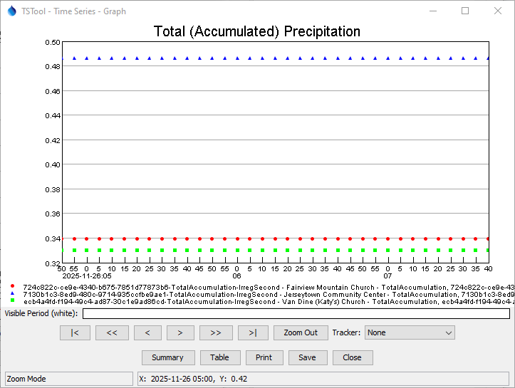
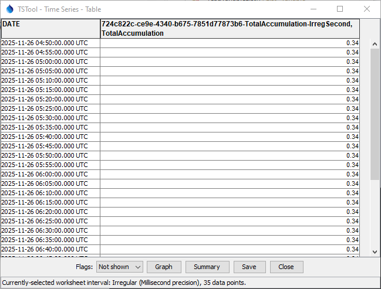

# TSTool Campbell Cloud Plugin / Introduction #

*   [Introduction](#introduction)
*   [TSTool use with Campbell Cloud Web Services](#tstool-use-with-campbell-cloud-web-services)

----------------------

## Introduction ##

TSTool is a powerful software tool that automates time series processing and product generation.
It was originally developed for the State of Colorado to process data for river basin modeling and has since
been enhanced to work with many data sources including:

*   United States Geological Survey (USGS) web service and file formats
*   Natural Resources Conservation Service (NRCS) web services
*   Regional Climate Center (RCC) Applied Climate Information Service (ACIS) web services
*   US Army Corps of Engineers DSS data files
*   others

TSTool is maintained by the Open Water Foundation,
which also enhances the software based on project needs.

*   See the latest [TSTool Documentation](https://opencdss.state.co.us/tstool/latest/doc-user/) to learn about core TSTool features.
*   See the [TSTool Download website](https://opencdss.state.co.us/tstool/) for the most recent software versions and documentation.
*   See the [Campbell Cloud Plugin download page](https://software.openwaterfoundation.org/tstool-campbellcloud-plugin/).

## TSTool use with Campbell Cloud Web Services ##

Campbell Cloud Web Services provide access to data that are maintained in the Campbell Cloud system.
See the following resources:

*   [Campbell Cloud Web Service Documentation](https://us-west-2.campbell-cloud.com/api/v1/docs/)

The [Campbell Cloud datastore documentation](../datastore-ref/CampbellCloud/CampbellCloud.md) describes how TSTool integrates with Campbell Cloud.

The [`ReadCampbellCloud`](../command-ref/ReadCampbellCloud/ReadCampbellCloud.md) command can be used to read time series,
in addition to [time series identifiers](../command-ref/TSID/TSID.md) that are generated from the main TSTool interface.

The following examples showing how to query battery voltage (`BattVoltage`) time series and the resulting time series graph.

**

**

**

TSTool Main Interface (<a href="../tstool-main.png">see full-size image)</a>

**

**

**

**

TSTool Graph for a Historical Period (<a href="../tstool-graph.png">see full-size image)</a>

**

Campbell Cloud data measurement intervals and timestamps vary depending on the station configuration and sensors that are used.
For example, the following illustrate Campbell Aspen 10 station battery voltage (`BattVoltage`) data for several stations.
Note that the graph appears to show a 10-minute interval for data, which are instantaneous samples.

**

**

**

TSTool Graph for Battery Voltage Data (<a href="../tstool-graph-VB.png">see full-size image)</a>

**

However, a closer examination of the tabular data shows that the timestamps for each value
have regular 10-minute spacing, but the second and sub-second values are not zero,
as shown in the following table.

**

**

**

TSTool Table for Battery Voltage Data (<a href="../tstool-table-VB.png">see full-size image)</a>

**

The following graph illustrates Aspen 10 accumulated precipitation (`TotalAccumulation`) for several stations.
Note that the graph appears to show a 5-minute interval for data, which are total accumulation as of the timestamp.

**

**

**

TSTool Graph for Accumulated Precitation Data (<a href="../tstool-graph-PC.png">see full-size image)</a>

**

A closer examination of the tabular data confirms that the timestamps for each value
have regular 5-minute spacing, and the second and sub-second values are zero,
which is indicative of a computed value.

The nuances of data requires that software that consumes the data is able to handle Campbell Cloud conventions.
See the [Campbell Cloud DataStore](../datastore-ref/CampbellCloud/CampbellCloud.md)
documentation for more details about data conventions.

**

**

**

TSTool Table for a Accumulated Precipitation Data (<a href="../tstool-table-PC.png">see full-size image)</a>

**
